<h1 align="center">
  Image Processing Labs
</h1>

# Overview

This repo is a collection of all image processing assignments completed using SK-image in python in fulfillment of an academic image processing course.

 

## Lab 1 - Warm Up

A warm up lab on using SK-image functions and working with HSV colorspace and Histograms

 

## Lab 2 - Frequency Domain

Working with frequency domain and conversions between it and Spatial domain. Also, Applying Filters by Convulotion

 

## Lab 3 - Smoothing

Removing Salt & Paper Noise and Gaussian Noise; By Implementing Median and Gaussian filters.

 

## Lab 4 - Contrast Enhancement

Applying grayscale transformation techniques, mainly negative transformation, contrast enhancement, gamma correction, and histogram equalization.

Below are some results from applying histogram equalization.

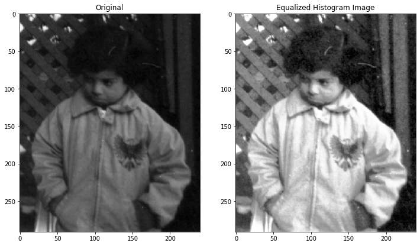

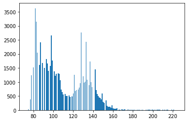
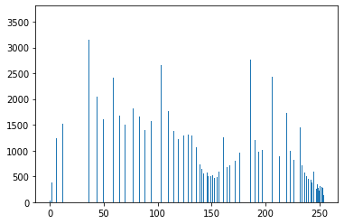

 

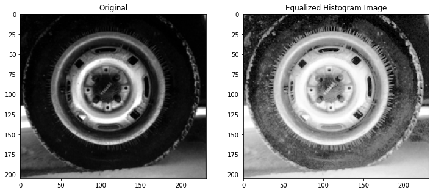

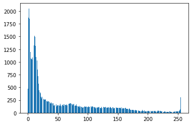
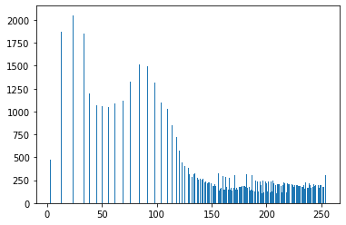

 

## Lab 5 - Edge Detection

Implementing a few edge detection algorithms, Sobel and laplacian of gaussian, and comparing them with scikit-image edge detectors.

 

## Lab 7 - Thresholding

### 7.1 - Background/Foreground Segmentation

Using different thresholding conditions on the 3 channels of the image followed by morhphological operations we were able to segment:

1. the foregorund (golf ball and target)
2. the golf ball only

as shown below

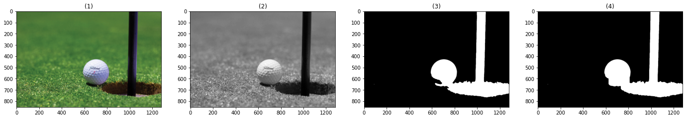
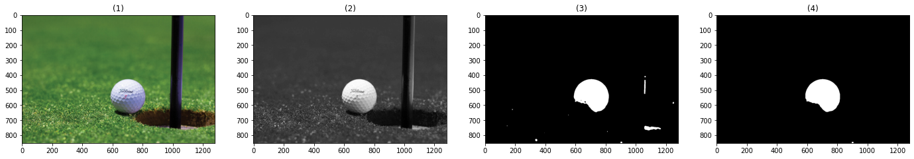

 

### 7.2 - Changing a specific color in image

Using thresholding on the green color in the HSL color model (by an ellipsoid equation), we were able to select grass pixels and turn them into orange

as shown below

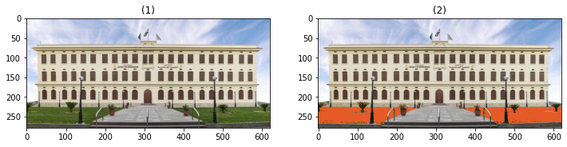

 

## Lab 8 - Adaptive Thresholding

Recursively splits image and applys thresholding to a local segment of the image. Some examples are shown below (left: input, middle: result of global thresholding, and right: local thresholding)

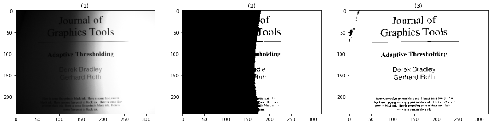
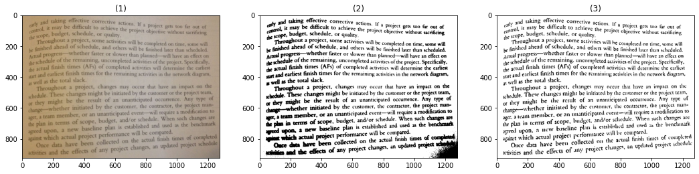

